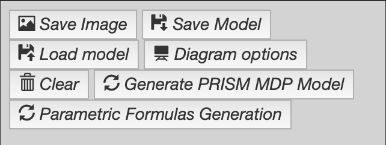
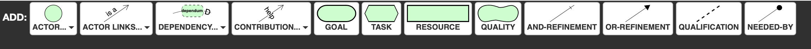
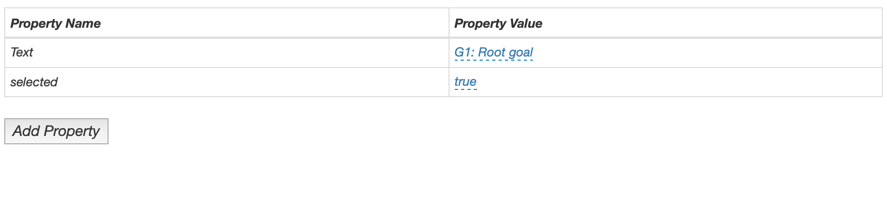
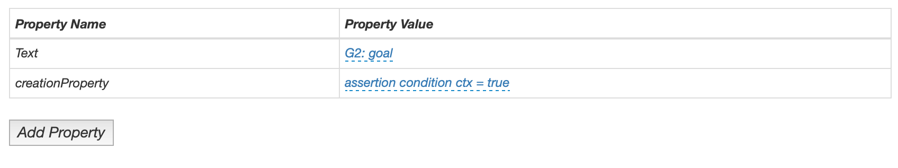
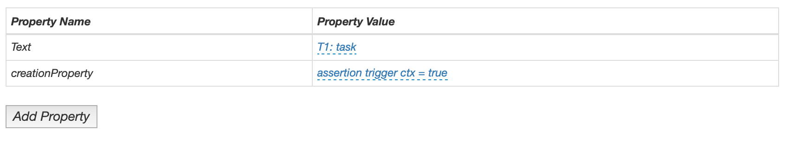
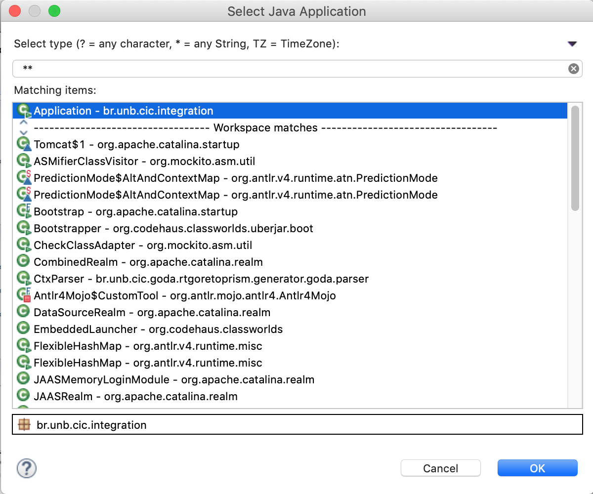

# PistarGODA MDP
This artifact extends [GODA framework](https://github.com/lesunb/CRGMToPRISM/) into supporting the goal modeling of SAS under multiple classes of uncertainty (named uncertainty related to the system itself, to system goals, and the environment). From the goal model, the framework automatically generates: (1) reliability and cost parametric formulas parameterized with uncertainty; and (2) a Markov Decision Process (MDP) of the system alongside PCTL properties. The formulas express the modeled system's overall reliability and cost. They are used for runtime verification and to guide the sysnthesis of adaptation policies in SAS (see [article](docs/Taming+Uncertainty+in+the+Assurance+Process+of+Self-Adaptive+Systems+a+Goal-Oriented+Approach.pdf)). The MDP and PCTL files are used for probabilistic model checking (in which we refer to the [PRISM tool](http://www.prismmodelchecker.org)). The source code extends the [piStar tool](http://www.cin.ufpe.br/%7Ejhcp/pistar/#) and provides a modeling and analysing environment in the web for GODA. The pistarGODA modeling and analyzing environment is available online at [Heroku](https://seams2019.herokuapp.com/).

## Modeling Instructions

### Modeling Menu

#### Clear
Clear the current goal model.

#### Load model
Load existent *.txt* file. Folder [**examples**](docs/examples/) contains examples of goal models to be loaded.

#### Save file
Save the model as a *.txt* file for future use.

#### Parametric formula generation
Once the goal model is finished, generate its reliability and cost parametric formulas (*result.out* and *cost.out*, respectively). Other outputs are: MDP model (file *.nm*) and PCTL properties (files *.pctl*) to be evaluated by a PRISM model checker; and Script *eval_fomula.sh* to evaluate the verification time of the formulae. We refer to [Section III.C of the article](docs/Taming+Uncertainty+in+the+Assurance+Process+of+Self-Adaptive+Systems+a+Goal-Oriented+Approach.pdf) to understand the practical use of the formulae. 

#### Generate PRISM MDP code
Once the goal model is finished, generate its correspondent MDP model in PRISM language (file *.nm*).

### New model 
Use the upper menu to insert entities (actor, goals, tasks) and their refinements (AND/OR-Decomposition) into your new goal model. First, insert a new actor. Then, you can create goals/tasks inside your new actor. Double click on the entity to edit its label. We refer to our [article's Background section](docs/Taming+Uncertainty+in+the+Assurance+Process+of+Self-Adaptive+Systems+a+Goal-Oriented+Approach.pdf) for further knowledge on goal modeling.

#### Adding properties

Your root goal should **always** have the "selected true" property:
* Click on the root goal > Add property > Name: *selected* > Value: *true*

To add a **context condition** in a **goal**:
* Click on the specific goal > Add property > Name: *creationProperty* > Value: *assertion condition **context***

To add a **context condition** in a **task**:
* Click on the specific task > Add property > Name: *creationProperty* > Value: *assertion trigger **context***

The ***context*** follows a specific regex.

### Context condition regex
Context conditions are formed by a proposition of context facts. You must use valid PRISM operators to define your context facts and to compose a valid context annotation. Valid operators are: 

<, <=, >, >=, =, !=, &, |

Operands are the context facts and the values they can be compared with. Context facts are represented as meta-variables. They must start with normal, non-digit characters and may end with digits. Values can be either boolean (true or false), integer or double. 

Valid context annotation examples are:

* BATTERY >= 50
* CONNECTION = true
* BATTERY >= 50 & CONNECTION = true

### Syntax used to label Goals and Tasks 

Goals and tasks must have a lable according to the rules bellow. The general form of a lable is:

* *IDENTIFIER*: *DESCRIPTION* *[decision-making annotation]*

#### *IDENTIFIER*: *DESCRIPTION*

* Goals must use a **prefix G** followed by an **unique numeric ID** within the CRGM Goals set followed by a **colon** followed by a **textual description** . Ex: G1: Goal description, G2: Goal description, G3: Goal description

* Same rule used for Goals, except that:
	* Tasks must use a **prefix T** 
	* Task level refers to the depth level after the goal they succeed
	* Level 1 tasks' prefix should be followed by an **unique numeric ID** within their context. Ex:
		* T1: Task description (for goal **G2**)
		* T1: Task description (for goal **G3**)
	* Second and subsequent level tasks prefix must be followed by the same **unique numeric ID** of its first level task, a **dot** and an **unique numeric ID**. Ex:
		* T1.1: Tsk Dsc, T1.2: Tsk dsc (descendants of T1)
		* T1.11: Tsk dsc, T1.12: Tsk dsc (descendantas of T1 -> T1.1) 
		* T1.111: Tsk dsc, T1.112: Tsk dsc, T1.113: Tsk dsc... (descendants of T1 -> T1.11) and so forward.

#### *[Decision-making annotation]*

* Any non-leaf node (goal or task) that is refined/decomposed into two or more sub-nodes can have a *decision-making annotation* as part of its label. A node with this annotation can be satisfied by any combination of its specified children.
* *decision-making annotations* must be inside brakets and be placed after *DESCRIPTION*. Ex:
* G1:Goal description **[DM(G2,G3,G4)]**, meaning that the fulfillment of any combination of G2, G3, G4 will result in the fulfillment of G1.
* *decision-making annotations* must be separated from *DESCRIPTION* with space(s). As long as it is inside the brakets and after *DESCRIPTION*, it will be parsed.

#### Incomplete Node

#### *Weigth function*

* Any leaf-task can be annotated with a weigth function that determines the cost/reward of executing such node.
* The weight function regex is: *W = value*, in which *value* can be either a double, a string variable, or both.
* The weight function must be inside brackets and be placed after *DESCRIPTION*. Ex: T1.1: Leaf-task description **[W = 0.1x]**
* The weight function must be separated from *DESCRIPTION* with space(s). As long as it is inside the brakets and after *DESCRIPTION*, it will be parsed.

## Development

### Installation 
To run the source code locally:
* Clone this repo: $ git clone https://github.com/gabrielasolano/Seams2019.git
* Import it as a *Maven project* in your IDE.
* Run as *java application*, selecting *Application* from *br.unb.cic.integration*.

* In your browser: *localhost:8080* to use the framework.

These are the steps when using the Eclipse IDE. Adaptation may be needed when using a different IDE.

### Updating an ANTLR grammar

* After updating any .g4 grammar file (for context or runtime annotations), use maven to recompile the java classes for your language (regex, parser, etc):
	* At the project root folder, use (linux): mvn install -Dmaven.test.skip=true
	* At the project root folder, use (linux): mvn package -e -Dmaven.test.skip=true
	* Refresh the project folder in your IDE (Eclipse, etc.)

## Bugs? Doubts?

* Look for existing issues or create a new one describing your problem or doubt
* Contact the author by email
	* felix.solano[at]gmail[dot]com
	* TODO: add other team members contacts here
